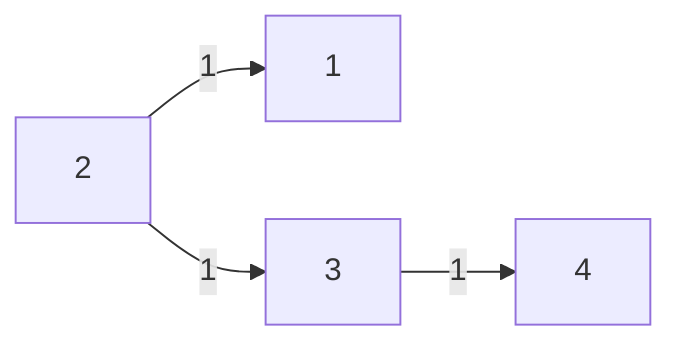

# When BFS Isn't Enough: From SPFA to Dijkstra on Network Delay Time

**TL;DR:** I accidentally implemented SPFA while thinking I was doing "BFS with relaxation," then had to build a min-heap from scratch before I could do Dijkstra properly. The benchmarking that followed — written with Claude — revealed a clean crossover point that shifts with graph density and size.

---

## The Problem

[LeetCode 743 — Network Delay Time](https://leetcode.com/problems/network-delay-time/): you have a directed, weighted graph of `n` nodes. Send a signal from node `k`. Return the minimum time until all nodes have received it, or `-1` if any node is unreachable.

The classic example:



Signal from node 2 reaches 1 and 3 at t=1, then 4 at t=2. Answer: 2 — the time at which the *last* node is reached.

This is a shortest-path problem in disguise. The answer is the maximum over all nodes of the shortest path from `k`. The tricky part: you're not looking for *a* shortest path, you're computing the shortest path to *every* node simultaneously.

---

## My First Attempt: Accidentally Inventing SPFA

My instinct was BFS. The wrinkle with weighted graphs is that the first time you visit a node isn't necessarily via the shortest path. My fix: if we later discover a shorter path to a node, re-enqueue it so its neighbors can be updated.

```
queue ← k's neighbors (with initial costs)

while queue not empty:
    pop (node, cost)
    if cost < best_known[node]:
        best_known[node] = cost
        re-enqueue all neighbors of node with (cost + edge_weight)
```

This works. I was fairly happy with it — it handles re-relaxation, terminates, and passes all the tests.

Claude pointed out this algorithm has a name: **SPFA (Shortest Path Faster Algorithm)**. It's a known variant of Bellman-Ford using a queue instead of repeated full-graph sweeps. Correct for non-negative weights, but worst-case O(V·E) — nodes can be visited many times depending on input shape.

The right tool for non-negative weighted shortest paths is Dijkstra, which guarantees each node is settled exactly once. To implement Dijkstra, I needed a min-heap.

---

## A Necessary Detour: Building a Min-Heap

I'd used `std::priority_queue` before but never understood the internals. Before implementing Dijkstra, I wanted to build one from scratch.

A min-heap is a complete binary tree stored in a flat array. The minimum element is always at the root (index 0). Index relationships:

```
parent of i  →  (i - 1) / 2
left child   →  2i + 1
right child  →  2i + 2
```

Two operations do all the real work:

**`bubble_up`** — after inserting at the end, swap up with the parent while smaller than it:

```
[3, 5, 8, 7]  →  push(2)  →  [3, 5, 8, 7, 2]
                               swap(2, parent=5)  →  [3, 2, 8, 7, 5]
                               swap(2, parent=3)  →  [2, 3, 8, 7, 5]
```

**`bubble_down`** — after removing the root (replaced by the last element), swap down with the *smaller* child while larger than either:

```
[2, 3, 8, 7, 5]  →  pop()  →  [5, 3, 8, 7]
                                swap(5, smaller child=3)  →  [3, 5, 8, 7]
```

Claude wrote the unit test suite — 20 tests covering empty/size semantics, pop order across ascending/descending/random insertions, duplicates, interleaved push/pop, negative values, a 1000-element stress test, and a `std::pair<int,int>` test simulating Dijkstra's `(distance, node)` usage. I implemented `MinHeap<T>` against those tests.

---

## Coming Back: Dijkstra Properly

With a working min-heap, Dijkstra was straightforward. The heap stores `(cost, node)` pairs for every node on the search frontier. Each iteration, pop the cheapest — that node's distance is now final — then push its neighbors with updated costs.

The key addition over SPFA: a **stale entry check**. When a shorter path to a node is found after it's already in the heap, the old entry stays there. When we pop it later with a worse cost, we skip it:

```cpp
auto [time_so_far, node] = search_frontier.pop();
if (time_so_far > minimum_time_from_k[node - 1]) { continue; }
```

Without this, Dijkstra degrades toward SPFA — processing the same node multiple times. With it, each node is settled exactly once.

The cleanup also simplified the SPFA implementation. My original version tracked `prev_node` in every queue entry solely to look up edge weights from a separate `unordered_map<Edge, int>`. By storing `(dest, weight)` pairs directly in the adjacency list — the same structure Dijkstra uses — the separate map and the custom `Edge` struct with its hash specialization disappeared entirely.

---

## Benchmarking: The Natural Next Question

Two implementations of the same algorithm, different data structures underneath (deque vs min-heap). The natural question: does it matter, and when?

Claude wrote a Google Benchmark harness at my direction. Graph generation needed care: random edge counts risk disconnected graphs, which would make both algorithms return -1 on the same inputs. The fix is to always start with a chain `1→2→...→n` (guaranteeing reachability from node 1), then add random edges on top.

Density is parameterized as a percentage of the extra edges above the chain:

```
extra_edges = density_pct% × (n-1)²
total_edges = (n-1) + extra_edges
```

At `density=0%`: pure chain. At `density=100%`: all possible directed edges.

The benchmark ran a cartesian product:
- **n ∈ {10, 25, 50, 100, 200, 500}**
- **density ∈ {0, 5, 10, 15, 20, 25, 50, 75, 100%}**

Claude also wrote the `bench_report.py` visualization script at my direction — three views of the same data: time vs density (faceted by n), time vs n (faceted by density), and a heatmap of the SPFA/Dijkstra ratio across the full grid.

---

## What the Numbers Said

**The crossover density shifts left as n grows.** SPFA is only faster at low density (few paths to re-relax), but the threshold at which Dijkstra takes over drops as the graph gets larger:

| n | SPFA faster at... | Dijkstra wins from... |
|---|-------------------|----------------------|
| 25 | ≤ 15% | ≥ 20% |
| 50 | ≤ 5% | ≥ 10% |
| 100 | ≤ 0% | ≥ 5% |
| 200+ | only at 0% | immediately at 5% |

At n=500 with 5% density, that's ~12,500 extra edges — enough to trigger aggressive re-enqueuing in SPFA. The heap overhead in Dijkstra pays for itself almost immediately once the graph has any meaningful connectivity.

**The chain advantage is flat.** At density=0%, SPFA consistently beats Dijkstra by ~5% regardless of n. This makes sense: a chain has one path to each node, so SPFA never re-enqueues. The only difference is O(1) deque operations vs O(log n) heap operations for the same traversal. The gap doesn't grow because chain length adds linearly to both algorithms' work.

**The Dijkstra advantage compounds with n.** At 100% density:

| n | SPFA / Dijkstra ratio |
|---|----------------------|
| 25 | 1.32x |
| 50 | 1.56x |
| 100 | 1.89x |
| 200 | 2.22x |
| 500 | 2.56x |

SPFA's re-enqueue count grows super-linearly with both size and density. On a fully connected 500-node graph, Dijkstra is 2.56x faster — and the trend is still climbing.

The heatmap made the crossover band immediately obvious: a clean diagonal boundary running from upper-left (small n, low density — SPFA territory) to lower-right (large n, any density — Dijkstra territory).

---

## What I Took Away

I came into this problem expecting to implement Dijkstra. What actually happened: I implemented SPFA without knowing it, got corrected by name, had to stop and build a min-heap from scratch before I could do the thing I'd set out to do, then did it.

The benchmarking wasn't planned. It came out of a natural question once both implementations existed: does the heap overhead actually matter? The answer — yes, but only past a crossover point that shifts with graph size — felt worth documenting. On sparse graphs, SPFA's simpler data structure wins. On dense graphs or large n, Dijkstra's "settle each node once" guarantee pays off significantly.

The practical takeaway: Dijkstra is the right default for non-negative weighted shortest paths, but SPFA isn't just "wrong Dijkstra." On a chain or near-chain graph, it genuinely wins.
